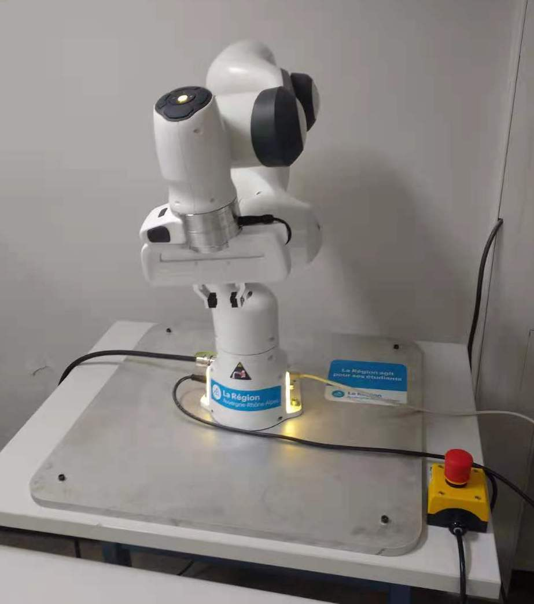
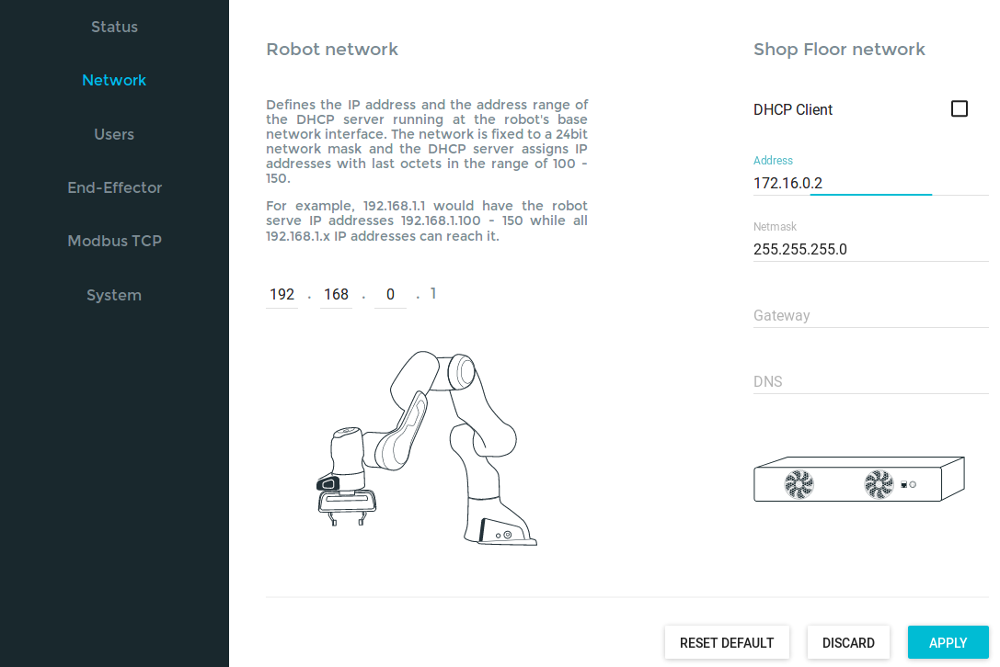
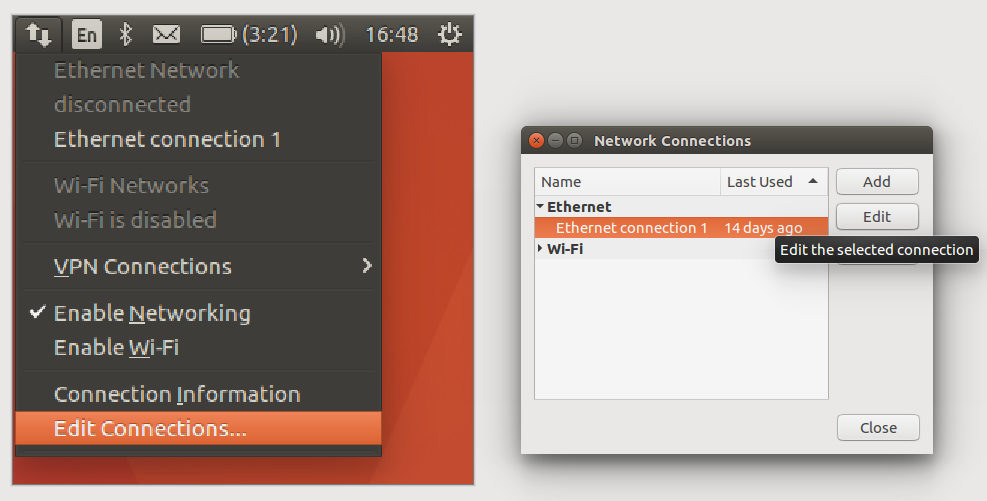

Getting started
===============

Connect your workstation to Panda
----------------------------------
The following contains is based on `FCI`_ documentation with only few modifications to adopt to our installation.

.. _FCI: https://frankaemika.github.io/docs/getting_started.html

.. warning::

  Be sure that you are in super user mode to allow the use of real time scheduling

you can do this in the terminal with:

.. code-block:: shell

   sudo su

1. Make sure that the Arm has been mounted on a stable base and cannot topple over, even when performing fast motions or abrupt stops.
2. Ensure that the cable connecting Arm and Control is firmly attached on both sides.
3. Connect the external activation device to Arm’s base and keep it next to you in order to be able to stop the robot at any time.

.. important::

  The workstation PC which commands your robot using the FCI must always be connected to the LAN port of Control (shop floor network) and not to the LAN port of the Arm (robot network).

Turn on your robot and wait until the light stabilises, make sure both emergency stops are pulled up as shown in the figure.

Verify that your Control's address is (172.16.0.2).

Control station configuration
-----------------------------
Open Panda Desktop and modify the Network as following:

Workstation network configuration
---------------------------------

After finishing these steps, we can open in chromo the address (http://172.16.0.2/) to access the robot desktop webpage.

Then unlock the robot's joints.

Switch to super user mode if you have not already done so.

You can test if the connection is established by the following commands:
.. code-block:: shell

   ping 172.16.0.2
   ./communication_test 172.16.0.2

You can launch a simple ros example by:

.. code-block:: shell

   roslaunch franka_example_controllers joint_position_example_controller.launch robot_ip:=172.16.0.2 load_gripper:=true

Working with velocity_qp
------------------------
A generic low-level joint velocity controller with a QP formulation developed by Lucas Joseph at INRIA Bordeaux, Auctus team.

.. code-block:: shell

   1. mkdir -p ~/auctus_ws/src
      cd ~/auctus_ws
      catkin config --init --extend ~/catkin_ws/devel --cmake-args -DCMAKE_BUILD_TYPE=Release -DFranka_DIR:PATH=~/libfranka/build -DCMAKE_CXX_FLAGS=-std=c++11

  2. cd ~/auctus_ws/src
  3. git clone https://gitlab.inria.fr/auctus/panda/velocity_qp.git
     wstool init
     wstool merge velocity_qp/velocity_qp.rosinstall
     wstool update
     cd ..
  4. rosdep install --from-paths src --ignore-src -r -y --skip-keys="libfranka"
  5. catkin_make

Delete qpOASES from auctus_ws/src repository, then, install the qpOASES from [mygithub](https://github.com/ZzhengP/robot_ws_zheng).
modify also the CMakeList.txt in velocity_qp repository. change tip_link name in velocity_qp.yaml to panda_link8. 

Practical run time issus
-------------------------

* Ensure that the robot configuration is not modified by other people
* Guide mode can be selected via robot desktop. When using guide mode, push the white/black botton to lower position.
* When you want to control the robot via your code, pull the botton, otherwise, you will see error as:

.. code-block:: shell

    libfranka: Set Joint Impedance command rejected: command not possible in the current mode
